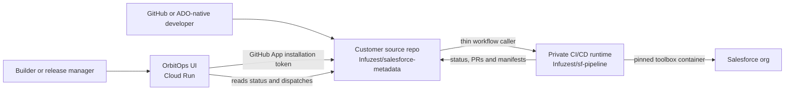

# OrbitOps DevOps and CI/CD operating guide

> **Authoritative operating reference — last verified 15 August 2026.**
> Update this document whenever a repository, account, deployment path,
> credential boundary, or workflow contract changes. Never place a token,
> password, private key, consumer-key value, or GitHub App installation ID here.

This guide describes the working OrbitOps proof of concept (PoC), who owns each
part, and how a change moves from a Salesforce development org to later
environments. It is written for human operators and AI coding tools.

## Current identities and accounts

| System | Current identity or account | Purpose |
|---|---|---|
| GitHub organisation | [`Infuzest`](https://github.com/Infuzest) | Owns all active OrbitOps PoC repositories and packages |
| Human GitHub operator | `Xyraxel` | Active local `gh` identity for maintenance and release work |
| GitHub service identity | `orbitops-poc-sfdcdevops[bot]` | GitHub App installation identity used by the hosted UI |
| Legacy GitHub account | `SalikPOC` | Authenticated locally but inactive; do not use for current work |
| Google Cloud account | `salik@simplecompanytax.co.uk` | Current human operator for the PoC GCP project |
| Google Cloud project | `sfdc-devops-dev` (`410154598522`) | Hosts the OrbitOps UI and its runtime secrets |
| Google Cloud region | `europe-west2` | Region for the Cloud Run service and related resources |

Before making a change, confirm the active identities:

```bash
gh auth status
gcloud config get-value account
gcloud config get-value project
```

The expected GitHub account is `Xyraxel`; the expected GCP account and project
are shown above. Every `gcloud` command for this PoC must include
`--project=sfdc-devops-dev` explicitly. Cloud Run commands must also include
`--region=europe-west2`. Do not rely on an implicit local default.

## Repository responsibilities

| Repository | Responsibility | Must not contain |
|---|---|---|
| [`Infuzest/sf-pipeline`](https://github.com/Infuzest/sf-pipeline) | Private central CI/CD runtime: reusable workflows, composite actions, scripts, schemas, tests, and the Salesforce toolbox image | Customer Salesforce metadata, customer topology, or customer credentials |
| [`Infuzest/salesforce-metadata`](https://github.com/Infuzest/salesforce-metadata) | Current PoC customer/source repository: Salesforce metadata, project configuration, and thin workflow callers | Copies of the OrbitOps runtime, actions, or pipeline implementation |
| [`Infuzest/orbitops-ui`](https://github.com/Infuzest/orbitops-ui) | Hosted Next.js control plane for builders, reviewers, release managers, and administrators | Salesforce source or the reusable CI/CD implementation |

`orbitops-engine` is only a local experimental scaffold. It has no active remote
and is not part of the deployed PoC. Do not depend on it or describe it as a
live service.



The UI and Git-native paths converge on the same customer repository. A user
does not need the UI to use the pipeline, and a browser using the UI never has
to authenticate to or load `github.com`.

## Sources of truth

| Information | Authoritative location |
|---|---|
| Salesforce metadata | Normal branches in `Infuzest/salesforce-metadata` |
| Stage order, branch mapping, default policy and org key | `.orbitops/pipeline.yml` in the customer repo |
| Connected-org username, org type and last known instance host | `connected-orgs.json` on the customer repo's `orbitops-meta` branch |
| Release/deployment/rollback records | Manifests on `orbitops-meta`, GitHub Deployments, tags and Actions runs |
| CI/CD implementation | Private reusable workflows and scripts in `Infuzest/sf-pipeline` |
| Browser-facing application configuration | Cloud Run environment variables and Secret Manager |
| Secret values used by customer workflows | GitHub Actions secrets on the customer repo for the PoC |

The `orbitops-meta` branch is operational state, not a deployment stage and not
a place for secret values. It may contain connected-org records, deployment
manifests, rollback previews and discard records. Normal feature work must not
be based on or merged into this branch.

## Current PoC topology

Always read `.orbitops/pipeline.yml` before operating the pipeline; the table
below is a dated snapshot, not a replacement for that file.

| Stage branch | Salesforce org key | GitHub environment | Current default tests | Ownership |
|---|---|---|---|---|
| `integration` | `DEV_DEV2` | `integration` | Conditional (run when the change contains Apex) | Developer-owned |
| `main` | `DEV_INTEGRATION` | `production` | `RunLocalTests` | Centrally governed |

Work-item enforcement is disabled for this PoC (`workItems.required: false`).
SARIF publication is also disabled, although the scanner gate still runs.
Those checks must not be silently re-enabled without configuring the required
Jira/Azure DevOps and GitHub code-scanning capabilities.

## Customer-repository contract

The customer repo contains one-line reusable-workflow callers such as
`retrieve.yml`, `pr-validate.yml`, `release-candidate.yml`, `deploy.yml`,
`rollback.yml`, `snapshot.yml`, and `full-scan.yml`. Each calls a private
workflow in `Infuzest/sf-pipeline` and passes only the declared inputs and
inherited secrets.

The reusable workflow checks out the *calling* customer repository. A private
runtime action then exposes the central runtime as `ORBITOPS_RUNTIME`. Do not
copy `.pipeline`, central scripts, or composite actions into a customer repo.
Each customer repo must be granted:

1. access to the private reusable workflows in `Infuzest/sf-pipeline`;
2. read access to the private GHCR toolbox package;
3. workflow permission `packages: read`; and
4. the required Actions secrets and variables described below.

For the PoC, callers use `@main` so a central pipeline fix takes effect without
a configuration PR in every customer repository. For production, protect the
runtime and pin customer callers to a tested release tag such as `@v1`.

## Git and promotion lifecycle

1. Create one feature branch for each change. Do not combine unrelated work.
2. Pull all or selected recent metadata from a connected development org, then
   curate the components in that feature branch.
3. Open or update the same pull request. A developer can push reviewer-requested
   fixes to the same branch; the UI sees the updated PR and checks.
4. Validation builds the exact candidate against the next Salesforce stage.
   Test level and specified test classes belong to this promotion request, not
   to a shared stage. The stage supplies defaults and non-overridable central
   policy limits.
5. Deploy the exact validated candidate to Salesforce first. Only after the
   real deployment succeeds may the target stage branch and release manifest
   be updated.
6. Several independent changes can be selected and promoted together. A later
   stage may promote only a subset—for example, five changes can enter UAT and
   only three continue to Production.

Every Salesforce stage must offer an execution-time test choice within its
policy: conditional/no-test where Salesforce permits it, `RunLocalTests`,
`RunSpecifiedTests`, or `RunRelevantTests`. Specified classes must be captured
with the individual promotion request. They do not have to be new files in the
Git delta, but they must exist in the target org or be included in the candidate.

There is deliberately no OrbitOps Salesforce deployment lock. Parallel jobs may
reach the same org; Salesforce performs its own deployment queuing. GitHub
environment approvals can still gate centrally owned stages.

## Salesforce authentication model

OrbitOps uses two Salesforce applications for different jobs:

- **OrbitOps Connect** uses OAuth Authorization Code with PKCE for the one-time
  human "Connect an org" journey. Salesforce returns the authenticated username
  and instance. The UI writes only non-secret org identity metadata and does not
  keep a refresh token.
- **Salesforce DevOps CI / OrbitOps CI/CD** is the packaged, pre-authorized JWT
  application used by automation. Production and its sandbox copies use the
  same consumer key and certificate. Each org needs the integration/deployment
  username assigned to the packaged permission set.

The customer repository currently has these PoC repository secrets:

| Secret name | Purpose |
|---|---|
| `ORBITOPS_JWT_CLIENT_ID` | Shared packaged CI/CD application consumer key |
| `ORBITOPS_JWT_KEY` | Matching JWT private key PEM |

Never print or copy their values into source, tickets, screenshots, or docs.
For JWT stages, `connected-orgs.json` supplies the username and org type; the
workflow derives the login service and learns the instance URL during auth.
The stored host is diagnostic/last-known data and can change after a refresh.

Current connected-org records include:

| Key | Display name | Deployment username | Last-known host |
|---|---|---|---|
| `DEV_DEV1` | Dev1 | `salik.bhatti@bupa.com.developer1` | `bupa--developer1.sandbox.my.salesforce.com` |
| `DEV_DEV2` | Dev2 | `salik.bhatti@bupa.com.developer2` | `bupa--developer2.sandbox.my.salesforce.com` |
| `DEV_INTEGRATION` | Integration | `salik.bhatti@bupa.com.integrate` | `bupa--integrate.sandbox.my.salesforce.com` |

Use the username as the durable logical identity for a sandbox. If JWT auth
fails because the app was removed, the permission was lost, or the username
was deliberately changed, mark the environment unhealthy and reconnect it.

## Runner and Salesforce toolbox model

Salesforce jobs run in the private image:

`ghcr.io/infuzest/orbitops-sf-toolbox:2.142.7-sgd6.45.1-ca5.14.0-r2`

The Salesforce CLI, `sfdx-git-delta`, and Code Analyzer are installed in the
image. The workflow verifies the versions; it must not run `npm install` for
these tools on every job.

The current customer repository variable is:

```text
ORBITOPS_TOOLBOX_RUNNER_LABELS=["ubuntu-latest"]
```

No organisation/self-hosted runner pool is active. GitHub-hosted runners can
run concurrently, but a cold job downloads and starts the toolbox image. A
future self-hosted or Actions Runner Controller pool may cache image layers and
reduce startup time; do not set a self-hosted label until matching online
runners are actually shared with the customer repo.

## Hosted UI on Google Cloud

| Resource | Current value |
|---|---|
| Project | `sfdc-devops-dev` |
| Region | `europe-west2` |
| Cloud Run service | `sfdc-devops-ui` |
| Service URL | `https://sfdc-devops-ui-410154598522.europe-west2.run.app` |
| Artifact Registry repository | `sfdc-devops` |
| Runtime service account | `sfdc-devops-runtime` in project `sfdc-devops-dev` |
| Secret Manager names | `poc-password`, `auth-secret`, `github-app-private-key` |

Cloud Build executes the application tests, builds and pushes the container,
and deploys Cloud Run from `orbitops-ui/cloudbuild.yaml`. The currently reliable
operator path is an authenticated local Cloud Build submission:

```bash
gcloud builds submit \
  --project=sfdc-devops-dev \
  --config=cloudbuild.yaml
```

Run it only from a clean, reviewed `Infuzest/orbitops-ui` revision. Confirm the
result against the Cloud Run URL and inspect the new revision before declaring
the release complete.

`orbitops-ui/.github/workflows/deploy-gcp.yml` is the desired keyless automated
path using Workload Identity Federation (WIF), but it is not yet operational.
At the verification date the repository did not have all required variables,
including `GCP_WORKLOAD_IDENTITY_PROVIDER`. Do not assume a merge to `main`
deployed the UI until that bootstrap is completed and the workflow is green.

Required non-secret repository variables for the intended path are:

- `GCP_PROJECT_ID`
- `GCP_WORKLOAD_IDENTITY_PROVIDER`
- `GCP_DEPLOY_SERVICE_ACCOUNT`
- `PIPELINE_REPO`
- `GITHUB_APP_ID`
- `GITHUB_APP_INSTALLATION_ID`
- `POC_USERNAME`
- `SF_OAUTH_CLIENT_ID`
- `SF_PACKAGE_VERSION_ID`

Runtime secret values stay in Google Secret Manager and must not be copied into
GitHub variables or the container image.

## GitHub App access

The hosted UI signs a short-lived installation token using
`github-app-private-key` in Secret Manager. The browser receives neither that
key nor a GitHub token and does not use GitHub OAuth. The App must be installed
on each customer source repo the UI manages and have only the permissions
listed in the UI repository's `docs/GITHUB_APP.md`.

When onboarding a new customer source repo:

1. install or grant the GitHub App access to that repo;
2. grant private Actions access from `Infuzest/sf-pipeline`;
3. grant GHCR toolbox-package read access;
4. add the thin workflow callers and `.orbitops/pipeline.yml`;
5. add `ORBITOPS_JWT_CLIENT_ID` and `ORBITOPS_JWT_KEY` securely;
6. create the stage branches and matching GitHub environments;
7. set `ORBITOPS_TOOLBOX_RUNNER_LABELS` to labels that really exist; and
8. connect the Salesforce orgs and verify a retrieve, validation, and release.

## Operational troubleshooting

| Symptom | Check first | Corrective action |
|---|---|---|
| Job says "Waiting for a runner" | Requested labels in the run | Set `ORBITOPS_TOOLBOX_RUNNER_LABELS` to `["ubuntu-latest"]` or bring matching shared runners online |
| Toolbox pull returns `denied` | GHCR package access and `packages: read` | Grant the customer repo read access to the private package |
| CLI appears to install on every run | Job logs and image tag | Ensure the job uses the toolbox container and the central `sf-auth` action only verifies installed versions |
| `client-id required for jwt` | Shared repo secrets and org registry resolution | Add the two `ORBITOPS_JWT_*` secrets and ensure the org key exists in `connected-orgs.json` |
| "External client app is not installed" | Packaged CI/CD app and permission-set assignment in the target org | Install the correct package/app, pre-authorize it, assign the deployment user, and retry after propagation |
| Connect-org redirect mismatch | OrbitOps Connect callback URL | Make the Salesforce callback exactly match the hosted callback; never use `0.0.0.0` for Cloud Run |
| GitHub-to-GCP deploy fails before auth | WIF variables and IAM trust | Complete the WIF bootstrap or use the explicit-project Cloud Build operator path |
| Re-run does not use a runtime fix | GitHub workflow snapshot | Trigger a fresh event; a GitHub "re-run" uses the original workflow revision |
| Parallel Salesforce jobs overlap | Expected PoC behaviour | Let Salesforce queue them; do not add an OrbitOps org lock without a new design decision |

## Change-control rules for humans and AI tools

- Inspect the current repo, branch, remote, active GitHub identity and active
  GCP identity before changing or publishing anything.
- Preserve unrelated local work. Use a separate worktree if the checkout is
  dirty or on an unrelated branch.
- Pipeline implementation changes belong in `Infuzest/sf-pipeline`; customer
  repos receive only a stub/version change when the caller contract changes.
- UI changes belong in `Infuzest/orbitops-ui` and require TypeScript, lint and
  relevant tests before deployment.
- Salesforce metadata changes belong in a feature branch of the customer repo
  and move through PRs; never write them directly to a stage branch.
- Never commit secrets, generated Salesforce auth URLs, PEM keys, `.env.local`,
  or GitHub App IDs that are being treated as sensitive configuration.
- Never publish from `SalikPOC` for the current PoC. Use the `Infuzest`
  repositories and the `Xyraxel` human identity unless ownership changes are
  explicitly documented here.
- Do not claim that the GitHub WIF deployment or a self-hosted runner pool is
  operational until a real green run proves it.

## Known PoC gaps

- Application login is a loose username/password PoC, not enterprise SSO.
- The automated GitHub-to-GCP WIF deployment requires bootstrap variables/IAM.
- Customer JWT secrets are repository-scoped for the PoC; production should
  use centrally governed organisation/environment secrets or a brokered secret
  service with tenant isolation and rotation.
- `orbitops-meta` is acceptable PoC operational storage. A scalable multi-tenant
  design should move health and UI-owned runtime state to a proper data store
  while keeping Git/Azure DevOps-native policy in the provider.
- Customer callers use `@main`; production should consume protected release tags.

Related references: [platform setup](SETUP.md), [operator runbook](RUNBOOK.md),
[release lifecycle](RELEASE_CYCLE.md),
[`orbitops-ui` GCP guide](https://github.com/Infuzest/orbitops-ui/blob/main/docs/GCP_POC.md),
and [`orbitops-ui` GitHub App guide](https://github.com/Infuzest/orbitops-ui/blob/main/docs/GITHUB_APP.md).
